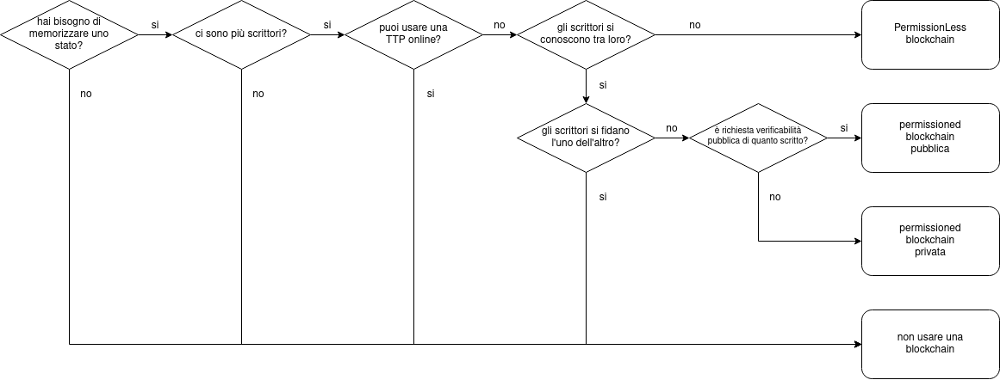

# Blockchains

Registro decentralizzato, condiviso e pubblico relativo alla proprietà di qualcosa, qualcosa di digitale.

I nodi memorizzano le transazioni.

Non c'è un admin, tutti sono allo stesso livello, tutti possono fare le stesse cose.

Organizzazione a blocchi:

- prima c'è il genesis block

- altri blocchi collegati: alcuni formano la catena

- ogni nodo è legato al blocco successivo da una funzione di hash

- ogni blocco contiene diverse transazioni

- di ogni blocco viene calcolato l'hash e viene memorizzato nel blocco successivo

Sono reti p2p, i membri validano le transazioni con un protocollo di consenso, basato su proof-of-work.

Le transazioni sono (pseudo) anonime

Ci possono essere nodi orfani, le transazioni registrate su questi nodi non valide.

## Bitcoin

Criptomoneta del 2008

Transazioni complicate.

Ogni utente ha un indirizzo, chiave pubblica

Algoritmo crittografia a chiave asimmetrica.

Transazione alice bob:

- alice vuole mandare 1 btc a bob

- alice usa il suo wallet, specifica il numero di btc e l'indirizzo (chiave pubblica) di bob

- alice può specificare una fee per il miner

- alice fima la transazione con la sua chiave privata

- alice manda la richiesta della transazione alla rete p2p

- i miner verificano che la firma di alice è valida

- verificano che alice non abbia già mandato lo stesso bitcoin in precendenza

- miner registra transazione

I membri della rete p2p sono i miners. I miner osservano le transazioni e poi cercano di formare un nuovo blocco validando le transazioni.

I miner devono dimostrare di aver fatto un certo sforzo (proof-of-work) per formare il prossimo blocco della catena.

Proof-of-work diventa sempre più difficile: devono trovare collisoni della funzione di hash.

Viene preso il dato di cui devo calcolare il dato di cui devo calcolare il dato, gli viene aggiunto un nonce (nons) casuale, viene calcolato l'hash. Se hash ha un certo numero di 0 allora risultato valido e posso registrare transazioni.

Quindi miner sceglie ~1000 transazioni, spara a caso nonce, calcola hash blocco, se hash ha il numero di bit più significativi = 0 allora ok, se no ci riprova sparando a caso nonce.

Bitcoin sono in numero limitato, max 21 milioni

Ethereum -> smart contracts

Programmati nel linguaggio solidity (simile a java)

Sulla blockchain memorizzo bytecode

Ti serve davvero la blockchain?

